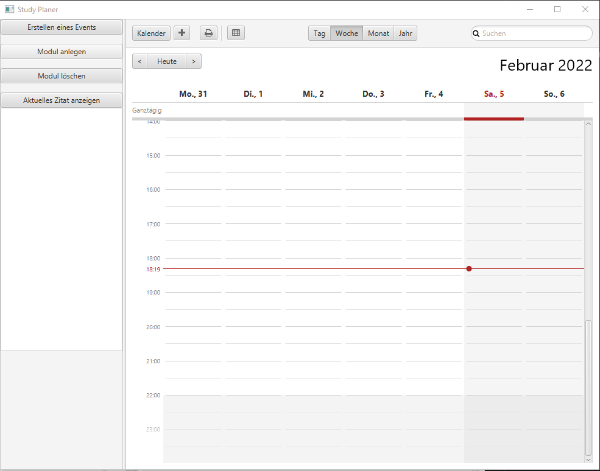

# StudyPlanner

Study Project

The user manual for the Study Planner
---

## Contents

1. About the Study Planner
2. Moduls:
    * How to add a Modul
    * How to edit a Modul
    * How to delete a Modul
3. How to build a timetable / learning session:
    * How to add a lecture / learning session
    * How to delete a lecture / learning session

---

## 1. About the Study Planner

This is how the calendar looks like:

You see your Moduls on the left side and the calendar on the right side.

to see the week click on **Woche** on the middle Top:

for a monthly overview click on **Monat**

Or if you want to see the whole year click on **Jahr**:

## 2. Modul

### How to add a Modul

- First Step:

You click on the button **Modul anlegen** to add a new Modul

- Second Step:

When you clicked on the **Modul anlegen** button a window will open in the middle of your Screen.

here you can set a ***Modul name*** and the Credit
Points for this modul. Then you can click on the ***Speichern*** button.

This is how it looks like when you added a Modul:

You have to click on the modul you want to change. Then you can set up your changes and click on the
***Ändern*** button.

### How to delete a Modul

When you want to delete a modul you have to click on the ***Modul löschen*** button. Select the modul you want to delete
and put a hack into the check box ***are you sure you want to delete this modul***.

## 3. How to build a timetable/ learning session

### How to add a lecture/ learning session

- First step:

You can add a lecture to your timetable while you click on the ***Erstellen eines Events***
button.

- Second step:

A window will open where you have to choose witch Modul you want to add to your timetable. Then you have to choose if
this event is a part of your ***learning session***
or your ***timetable***. You also have to choose the ***Anfangszeit*** and the ***Endzeit*** and the ***Datum***.

If you wish, you can choose a repetition cycle of 1 2 3 4 5 6 7 14 days unter **Wiederholungsrythmus in Tagen**, but don't forget to indicate until when the cycle should end in the field below.

Optionally you can add a description to the event.

**--> The credit points of a Modul will automatically convert into hours, and always when you add a lecture or a
learning session the time you invest in a modul will automatically decrease**

### How to delete a lecture / learning session

To delete a lecture or a learning session you have to right-click on the entry in your calendar you want to delete. Then
choose to delete or by selecting the event by left click and press delete on your Keyboard.
